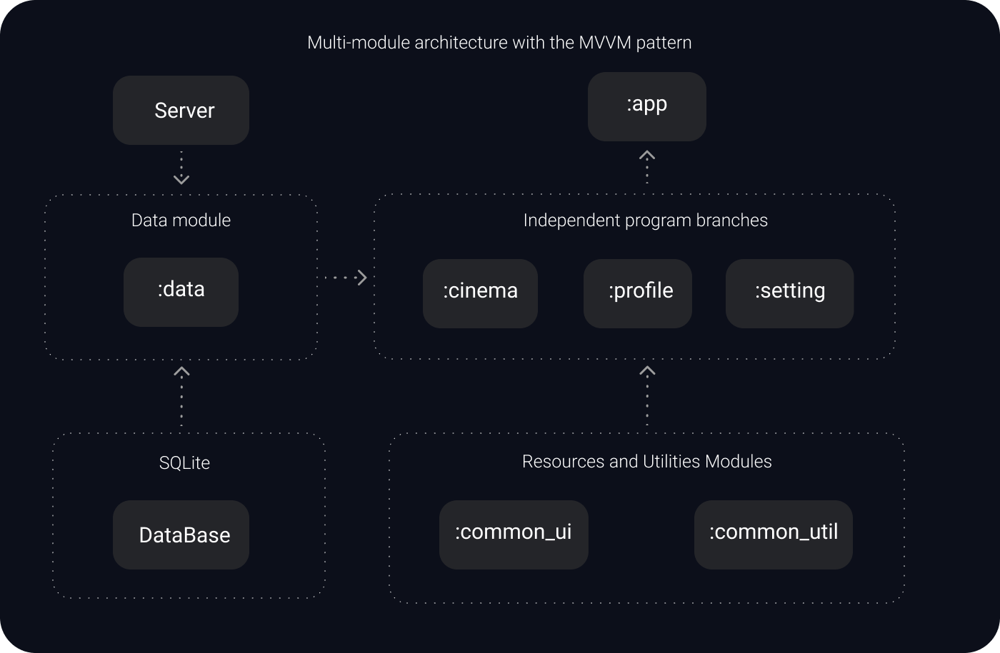
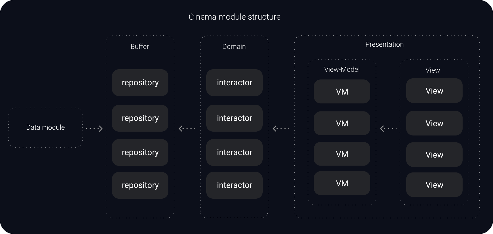
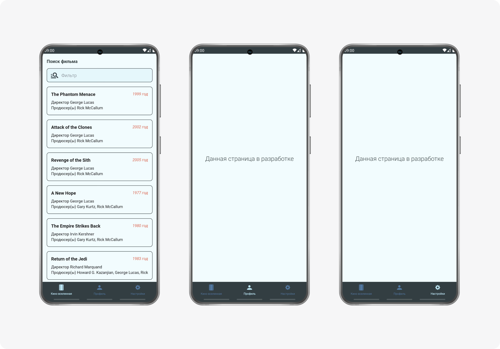
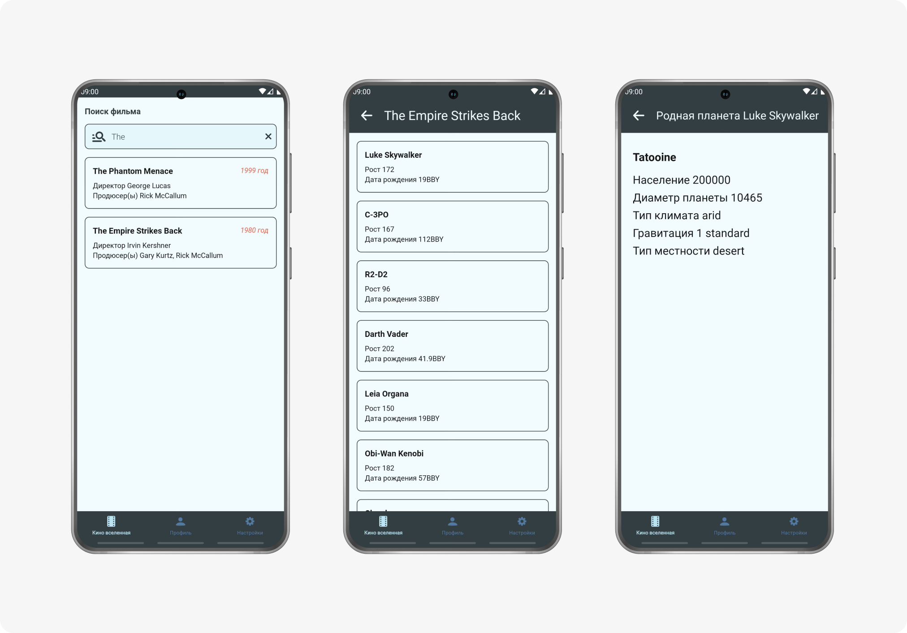

# SwApiApp
## Пример приложения поиска информации о кино-вселенной Звёздных войн
## Стек применяемых технологий:
1. Язык Kotlin
2. Многомодульная архитектура и паттерн MVVM
3. Библиотеки Koin, Glide, Gson, LiveData, Retrofit, Room
## Описание приложения:
* Для экономии вычислительных ресурсов используется принцип одной активности и множества фрагментов
* Навигация между фрагментами осуществляется с помощью NavController
* Для обеспечения стабильной работы BottomNavigationView используются вложенные навигационные граффы
* Многомодульность реализуется по следующей схеме:

В данной схеме слой **:data** вынесен в отдельный модуль для удобства масштабирования приложения

* Модуль **:cinema** реализован в соответствии с чистой архитектурой паттерна MVVM:

* Приложение протестированно на эмуляторе и реальном смартфоне с последующим устранением выявленных багов
* Скриншоты разработанного приложения:

Мобильное приложение разработано в учебных/образовательных целях на основе общедоступного [REST API SWAPI](https://swapi.dev/) https://swapi.dev/ (дата обращения 09 июля 2024 года)